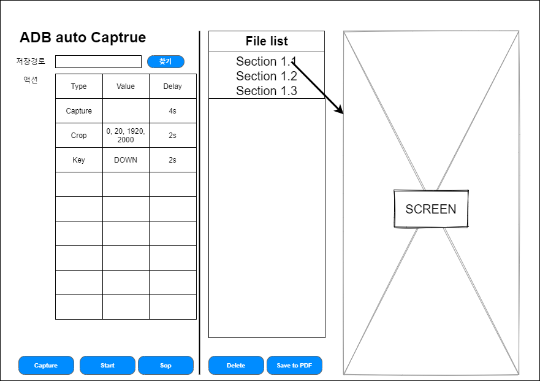

# adb-capture

## Todo
 - [x] 기본 UI 구성
 - [x] 저장 경로 설정
 - [x] 액션 목록 만들기
  - [x] 파일 읽기
  - [x] 파일 저장하기
  - [x] 셀 추가
  - [x] 셀 삭제
 - [x] 자동 기능 제작
  - [x] 캡쳐 (현재 페이지)
  - [x] 시작하기
  - [x] 중단 하기
 - [x] 파일 목록 표시 만들기
  - [x] 선택 파일 삭제 하기
  - [ ] 폴더 이미지를 pdf로 저장하기
 - [x] 현재 선택 파일 프리뷰 보기



## Use
### Install files...

#### Windows
파이썬을 3.6.8을 설치해 준다.
pyenv-win으로 설치하면 조금 쉽다.

### pyenv 설치하기

* choco : `choco install pyenv-win`

### 3.6.8 파이썬을 설치

```
pyenv install 3.8.10
pyenv local 3.8.10
python --version
```

* 윈도우에서 자꾸 스토어가 뜬다면 여기를 확인 해 보자.
  * https://stackoverflow.com/questions/58754860/cmd-opens-window-store-when-i-type-python

> %USERPROFILE%\AppData\Local\Microsoft\WindowsApps

위 폴더에서 `Python.exe`, `Python3.exe` 파일을 지워 줘야 한다.

### 파이썬 가상 환경 만들어 주기

```cmd
> python -m pip install --upgrade pip
> python -m pip install virtualenv
> python -m virtualenv venv
> .\venv\Scripts\activate
> pip install -r requirements.txt
```

# ui to py
```
pyuic5.exe -x .\mainUi.ui -o .\mainUi.py
```


#### Linux

```bash
$ sudo apt-get install chromium-chromedriver
$ python3 -m venv venv
$ source venv/bin/activate
$ pip install -r requirements.txt
```

------


## Make Install file..

### .spec 파일 만들기
```
pyi-makespec [--onefile] main.py
```

```
pyinstaller main.spec
```

또는
### 직접 빌드하기
```
pyinstaller --onefile -F --log-level DEBUG --debug main.py
```


# Update all package
```
pip freeze | %{$_.split('==')[0]} | %{pip install --upgrade $_}
```

# scrcpy
```
scrcpy -r tmp.mp4
ffmpeg -i tmp.mp4 -vframes 1 sshot.png
```

## Reference
* [ADB shell](https://adbshell.com/)
* [Python Capture Android Phone Screenshot using ADB – ADB Tutorial](https://www.tutorialexample.com/python-capture-android-phone-screenshot-using-adb-adb-tutorial/)
* [Android Shell (adb.exe) - 안드로이드 여러가지 명령어들](https://m.blog.naver.com/PostView.nhn?blogId=gyurse&logNo=220911727781&proxyReferer=https:%2F%2Fwww.google.co.kr%2F)
* [안드로이드 키 이벤트 (adb shell로 보내는 법)](http://www.dreamy.pe.kr/zbxe/CodeClip/164608)
* [ADB로 안드로이드 스크린 캡쳐하기 (Windows에 바로 저장하기)](http://heyo.net/wp/66574)
* [Convert Images to PDF using Python](https://datatofish.com/images-to-pdf-python/)